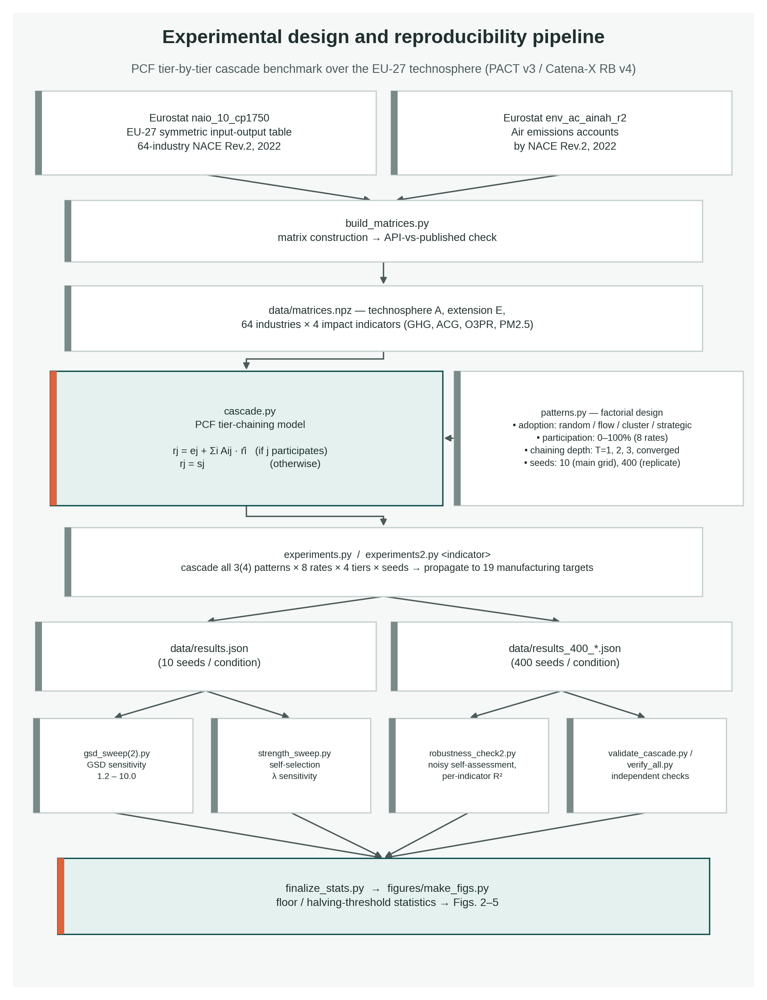

# The Scope 3 Data Dilemma: How Much Real Data Makes a Product Footprint Credible?

Companion repository for the manuscript submitted to the 34th CIRP Conference on
Life Cycle Engineering (CIRP LCE 2027):

> T. A. Khan, R. Kumar, V. Jayakumar, F. Cerdas, K. S. Sangwan, N. Khanna,
> "The Scope 3 Data Dilemma: How Much Real Data Makes a Product Footprint
> Credible?", Procedia CIRP, 34th CIRP LCE 2027.

All data are official EU statistics retrieved from public Eurostat API endpoints.
No commercial license, registration, or paid data access is required to reproduce
any result in this repository.



**Fig. A1.** Experimental design and reproducibility pipeline: Eurostat data build,
the PCF tier-chaining model crossed with the participation/depth/seed factorial
design, experiment execution, and the downstream sensitivity, validation, and
figure-generation stages. Boxes name the exact script or artifact responsible for
each stage; see [Experiment scripts](#experiment-scripts) below for the full
script-to-output mapping. Regenerate this figure with `figures/make_experiment_design_fig.py`.

## What this benchmarks

A tier-by-tier Product Carbon Footprint (PCF) cascade model, following the PACT
Methodology v3 and Catena-X PCF Rulebook v4 for cradle-to-gate footprint exchange
across supply-chain tiers (see `grounding.md` for the full model-to-standard
mapping). Supplier participation (the share of upstream industries reporting a
primary, self-measured PCF rather than a database-derived secondary factor) is
varied from 0 to 100% under three adoption patterns:

- **random** — suppliers volunteer in a uniformly random order;
- **flow** (flow-weighted) — suppliers volunteer in order of trade volume, largest
  first;
- **cluster** (sector-clustered) — suppliers volunteer by whole NACE section
  (consortia), one section at a time.

...crossed with four chaining depths (T = 1, 2, 3, and converged / fully chained),
four Eurostat-characterized impact indicators (GHG, acid gases, ozone precursors,
PM2.5), and participation rates from 0 to 100%. Every result is evaluated after
propagation through the full Leontief cascade to the nineteen manufacturing target
industries (NACE C10-12 through C33), not at the level of an individual reported
factor.

## Data build

Two Eurostat datasets, reference year 2022, geography EU27_2020:

- **naio_10_cp1750** — EU-27 symmetric input-output table, industry by industry,
  NACE Rev. 2 at 64-industry detail, current prices (million EUR).
- **env_ac_ainah_r2** — air emissions accounts by industry, NACE Rev. 2.

`code/build_matrices.py` retrieves both from Eurostat's public dissemination API
and writes the built technosphere/extension matrices to `data/matrices.npz`
(technosphere A, extension E, industry output x, intermediate-use Z, emissions F),
`data/industries.csv`, and a build-validation report (`data/checks.json`,
`data/build_check_all4.json`). Mapped-industry emissions reproduce Eurostat's
published EU-27 totals to within 0.001% for all four characterized indicators
(see `data/build_check_all4.json`). The already-built matrices are included in
`data/` so the benchmark can be rerun without re-hitting the API.

## Experiment scripts

| Script | Produces | Purpose |
|---|---|---|
| `code/build_matrices.py` | `data/matrices.npz`, `industries.csv`, `checks.json` | Data build from Eurostat |
| `code/cascade.py` | (library) | Cascade model: true PCF, secondary factors, tier-by-tier chaining, MAPE, ranking flips |
| `code/patterns.py` | (library) | Random / flow-weighted / sector-clustered / strategic participation orderings |
| `code/experiments.py` | `data/results.json`, `results.csv` | Main grid: 4 indicators x 3 patterns x 8 rates x 4 tiers x 10 seeds |
| `code/experiments2.py <indicator idx 0-3>` | `data/results_400_<idx>.json` (Zenodo archive only) | Same grid at 400 seeds/condition, nested participant ordering shared across indicators and tier depths, plus a fourth (strategic/self-selected) adoption pattern; chunked per indicator so each chunk completes in one run (~50 min/indicator — see `logs/`) |
| `code/equal_pds_check.py` | `data/equal_pds_check.json` | Equal-declared-PDS, cross-adoption-pattern comparison: re-plots accuracy against realized declared PDS (not raw participation rate) for random/flow/cluster, at 400 seeds/condition, converged chaining, to test whether flow-weighted's apparent accuracy advantage is genuine or a restatement of PDS itself |
| `code/gsd_sweep.py`, `gsd_sweep2.py` | `data/gsd_sweep.json`, `gsd_sweep_ext.json` | Sensitivity of interval coverage to the assumed pedigree-style GSD (1.2-3.0, extended to 10.0) |
| `code/strength_sweep.py` | `data/strength_sweep.json` | Self-selection strength sensitivity (gaming parameter λ) for the strategic adoption pattern discussed in Limitations |
| `code/robustness_check2.py` | `data/robustness_check2.json` | Noisy self-assessment, GHG-only selection basis, per-indicator R², bootstrap CIs |
| `code/validate_cascade.py`, `verify_all.py` | console PASS/FAIL | Independent end-to-end verification (Leontief identity, tier monotonicity, live Eurostat spot-checks against stored matrix cells) |
| `code/finalize_stats.py` | console output | Floor values and halving-participation thresholds reported in the manuscript, computed from the 400-seed grid |
| `figures/make_figs.py` | `figures/newfig2-4.png` | Renders Figs. 2-4 from the small extracted JSON summaries in `figures/` (`fig2_data.json` etc.), themselves derived from `data/results.json` / `data/results_400_*.json` |

## Headline findings (as reported in the manuscript)

1. **The primary-data dividend arrives late.** At zero participation the
   database-only floor is a median error of 13.85% (GHG), 23.10% (acid gases),
   18.56% (ozone precursors), and 18.85% (PM2.5) — already a spread of nearly
   10 percentage points depending on which pollutant is reported.
2. **Recruitment order matters more than headcount.** Flow-weighted adoption
   halves the GHG floor by 60% participation; random and sector-clustered
   adoption both need a uniform 80% to do the same.
3. **Chaining depth only pays off at high participation.** At ~20% participation,
   extending chaining from T=1 to converged trims GHG error only from 12.22% to
   11.98%; at 80% participation the same extension moves error from 8.03% down
   to 1.16%.
4. **Calibration fails where confidence looks highest.** Under flow-weighted
   adoption, GHG interval coverage starts near the nominal 95% at zero
   participation but falls to 76.7% by 80% participation, even as the interval
   narrows by roughly 90% — increasing apparent precision while increasing
   overconfidence.
5. **Decision stability tracks participation more tightly than point error does.**
   Database-only footprints reverse about 12.6% of material pairwise
   comparisons between manufacturing industries; that rate drops to 6.1% once
   flow-weighted participation passes 40%.

## Reproducing

```
pip install -r requirements.txt
python code/build_matrices.py            # optional: matrices.npz already included
python code/experiments.py                # -> data/results.json (10 seeds/condition)
python code/experiments2.py 0             # -> data/results_400_0.json (GHG, 400 seeds)
python code/experiments2.py 1             # ACG
python code/experiments2.py 2             # O3PR
python code/experiments2.py 3             # PM2_5
python code/equal_pds_check.py
python code/gsd_sweep.py && python code/gsd_sweep2.py
python code/strength_sweep.py
python code/robustness_check2.py
python code/validate_cascade.py && python code/verify_all.py
python code/finalize_stats.py
python figures/make_figs.py
```

`experiments2.py` is the slow step (~50 minutes per indicator on a single CPU
core — see `logs/exp_0.log` through `exp_3.log` for the timings behind the
included `data/results_400_*.json`, which ship only in the Zenodo archive, not
in the lean GitHub copy of this repository, for repository-size reasons). All
other scripts complete in well under a minute. Every stochastic draw is seeded
via an explicit `hashlib`-derived key or `numpy.random.default_rng`, never
Python's process-randomized `hash()`, so results are bit-exact reproducible
given the same seeds.

**Data availability note:** this GitHub copy omits the four 400-seed replicate
files (`data/results_400_0.json` … `results_400_3.json`, ~70 MB total) to keep
the repository small. They are included in full in the Zenodo archive of this
repository (see the manuscript's Data Availability statement for the DOI), or
regenerate them locally with the commands above.

## Limitations

- Three patterns and eight participation rates are simulated at an input-output
  testbed resolution of 64 industries, not a process-based inventory.
- The strategic/self-selected adoption pattern is one specification of a
  supplier-favorability-driven volunteering rule; `strength_sweep.py` explores
  its sensitivity to the assumed gaming strength, but it has not been validated
  qualitatively against real disclosure decisions (see the manuscript's
  Limitations section).
- Monte Carlo interval estimates use a fixed lognormal secondary-factor GSD of
  2.0 as the baseline assumption; `gsd_sweep.py`/`gsd_sweep2.py` test sensitivity
  to this choice across 1.2-10.0.

## License

Code in this repository is released under the MIT License (see `LICENSE`). The
underlying Eurostat-derived data (`data/matrices.npz`, `industries.csv`) are
reusable under Eurostat's own terms, which require acknowledgement of the
source; see https://ec.europa.eu/eurostat/about/policies/copyright.
